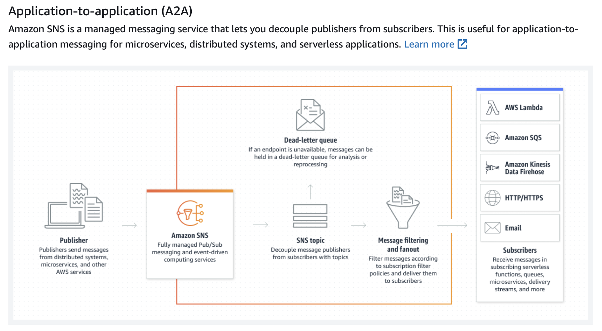
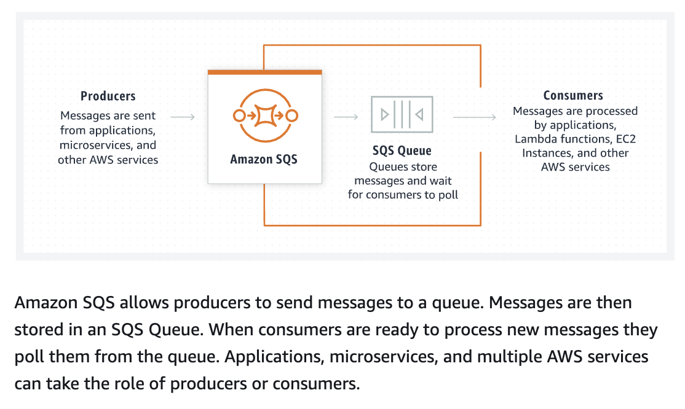

# Using AWS to create the Pub-Sub Model

- Combining Amazon SNS (Simple Notification Service) with Amazon SQS (Simple Queue Service) creates a scenario where SNS acts as a publisher to a topic, and SQS queues subscribe to that topic to receive messages
- SDK for JavaScript installed (npm install aws-sdk).
- 

- SNS > Topic > Topic Name: Channel1 and Display: Test-Channel-1
- Ensure that Topicnae and AWS Region is updated in send-message-sns.js
- Once Topic is created- Copy paste the ARN Created for this topic in subscribe-sqs-queue.js

- for Amazon SQS- A message queuing service
- Amazon SQS provides queues for high-throughput, system-to-system messaging. You can use queues to decouple heavyweight processes and to buffer and batch work. Amazon SQS stores messages until microservices and serverless applications process them.
- 

- SQS > Create Queue > Queue Name: MyQueue1 > create queue
- Update queue name in subscribe-sqs-queue.js
- Update the recieve-message-sqs-queue.js

---

# Monitoring Amazon SNS topics using CloudWatch

- To monitor the messages that are sent from SNS Publisher to Topic -> Use Cloud Watch
- https://docs.aws.amazon.com/sns/latest/dg/sns-monitoring-using-cloudwatch.html
- Goto Cloud watch, with Right Region [Cloud-Watch](https://us-east-1.console.aws.amazon.com/cloudwatch/home?region=us-east-1#home)
- Metric > All Metric > SNS > Topic Metric

---

# How to run the files in Sequence

- node send-message-sns.js
- node subscribe-sqs-queue.js
- node recieve-message-sqs-queue.js
